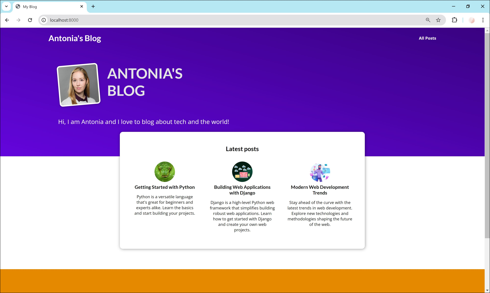
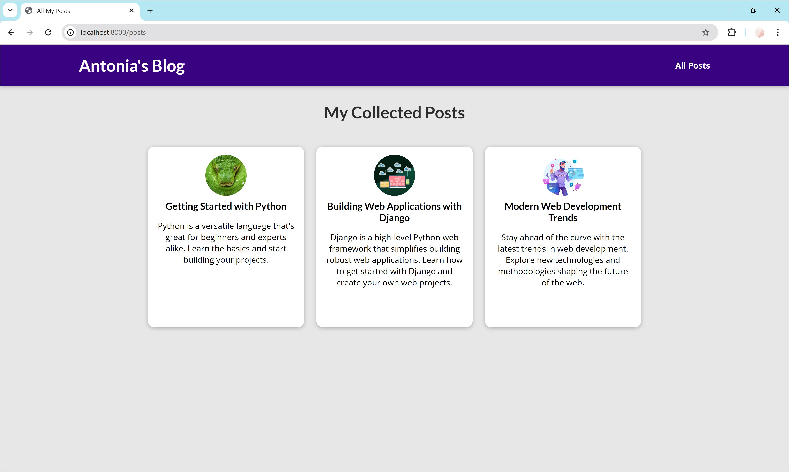

# My Site

Welcome to **My Site**, a Django-based web application. This project includes a blog where you can read posts.

## Project Structure

- **my_site/**: The main Django project directory containing settings, URLs, and WSGI configuration.
- **blog/**: A Django app handling blog posts and related views.

## Blog Features

- [x] View a list of recent blog posts.
- [ ] Create, edit, and delete blog posts.
- [ ] Comment on posts.

## Preview

Here are some previews of the site:





## Installation

1. Clone the repository:
   ```bash
   git clone https://github.com/thisisfrey/my_site.git
   cd my_site
   ```
2. Set up a virtual environment and install dependencies:

   ```bash
   python -m venv venv
   source venv/bin/activate
   pip install -r requirements.txt
   ```

3. Running the Server:
   ```bash
   python manage.py runserver
   ```
